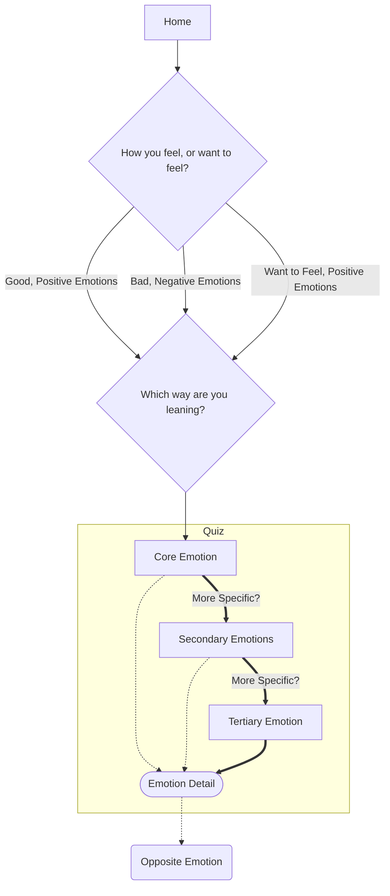

# emotion_wheel

Tool for self emotional awareness

## A Research Based Approach

This project is based on research from Gloria Willcox.

Citation: "Gloria Willcox (1982) The Feeling Wheel, Transactional Analysis Journal, 12:4, 274-276,
DOI: 10.1177/036215378201200411"

The goal is to provide a simple light-weight tool for identifying an emotion you are feeling or
would like to feel, but have trouble putting into words.

## Flutter Dev

From a Flutter Development perspective, it also provides a simple real-world app to
explore state management in Flutter using vanilla arguments, Provider, Riverpod, and BLoC.

- [Flutter Docs: List of state management approaches](https://docs.flutter.dev/development/data-and-backend/state-mgmt/options)

### BLoC

[Architecture Sequence Diagram](lib/bloc/bloc_architecture.md)

---

## App Structure

### Quiz Flow

