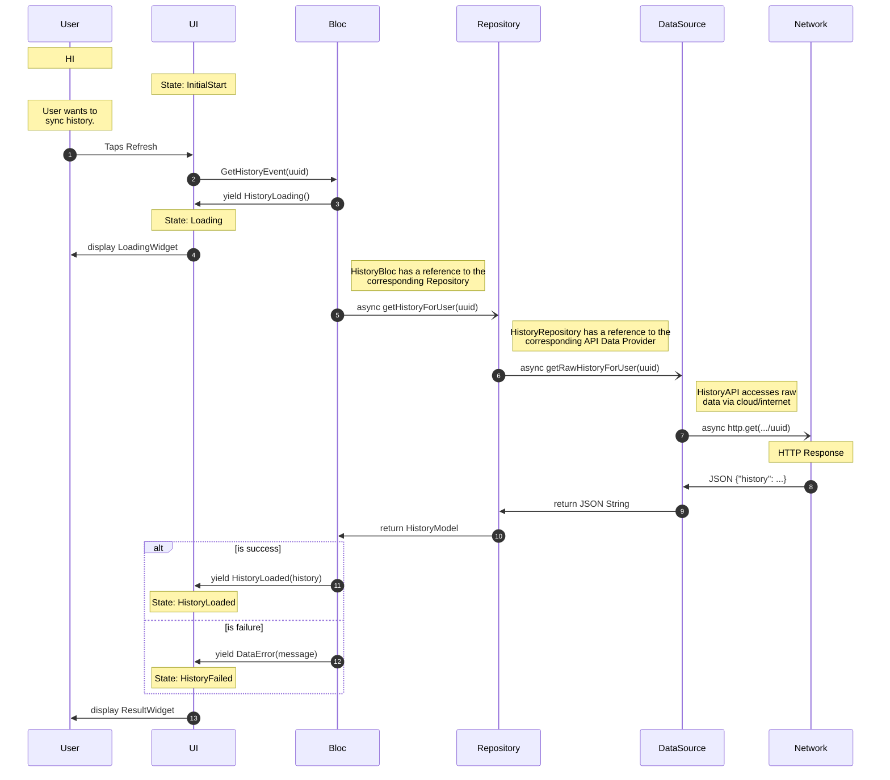

# BLoC Architecture

See: [The Best Flutter Bloc Complete Course](https://www.youtube.com/watch?v=THCkkQ-V1-8&t=3993s)

## General API request Sequence Diagram

Note: The Firebase API contains helpers and patterns that collapse parts of this architecture. 
For instance, a translator can be provided to the DataSource call so that it returns a model
object 
rather than raw JSON.
