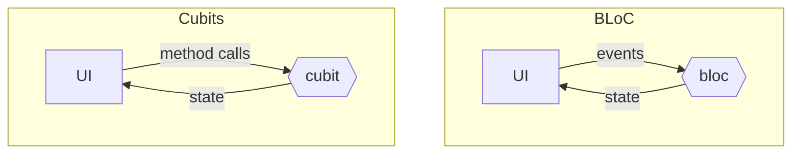
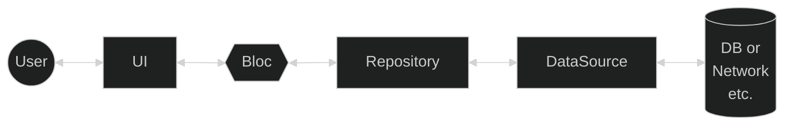
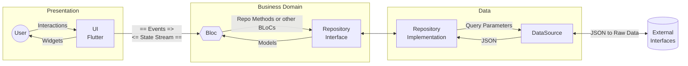
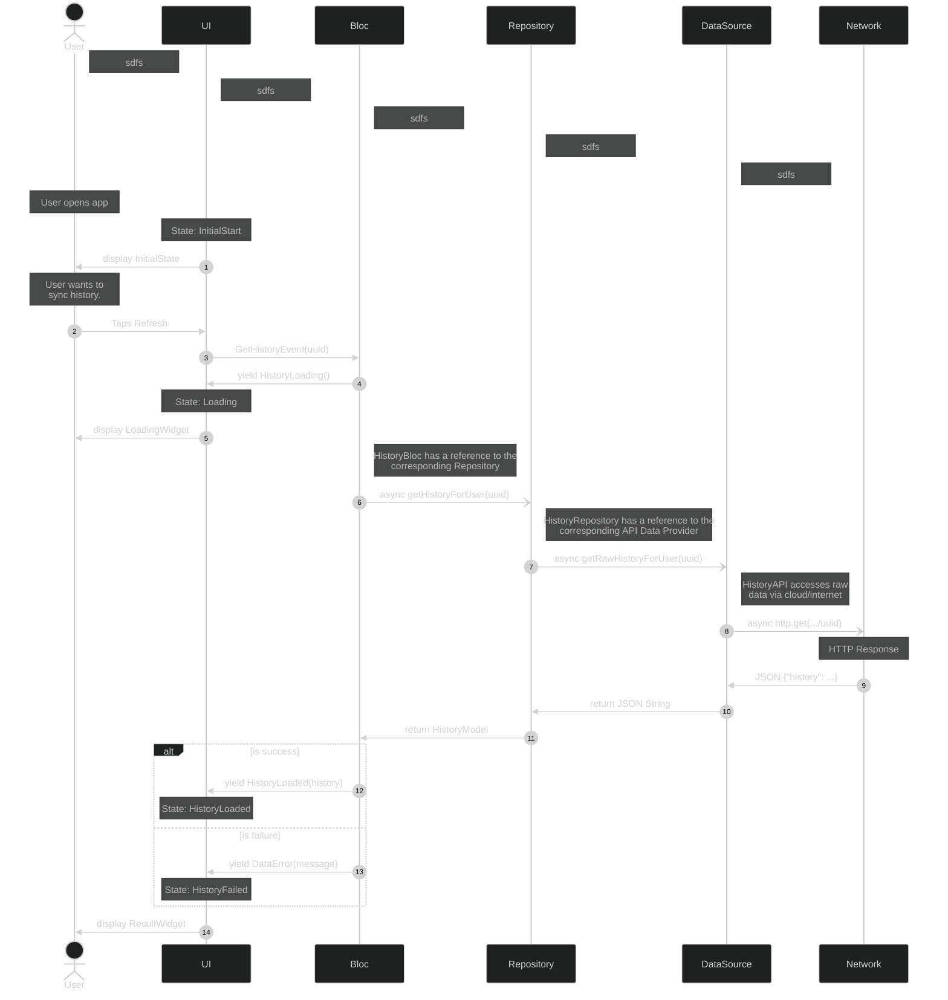

# BLoC Architecture

## What is a BLoC?

Blocs are related to Cubits. So, what's a Cubit? Specifically, methods are defined on a Cubit that
emit a new state for the Cubit's. The state could be a simple primitive type like int or String or
it could be a complex custom object like MyAppState.

Blocs are similar, but rather than a method call, Blocs listen for events and emit new states in
response. Each event will result in zero or more states emitted to the Bloc's state stream. This
stream can be listened to by widgets in the UI which will rebuild themselves accordingly.

**Definition:** A BLoC is a ***B***usiness ***Lo***gic ***C***omponent. They satisfy the role
of [Uncle Bob's "
Use Cases"](https://blog.cleancoder.com/uncle-bob/2012/08/13/the-clean-architecture.html).

In Uncle Bob's (or Robert C. Martin's) words:
> ### Use Cases
> The software in this layer contains application specific business rules. It encapsulates and
> implements all of the use cases of the system. These use cases orchestrate the flow of data to and
> from the entities, and direct those entities to use their enterprise wide business rules to
> achieve
> the goals of the use case.
>
> We do not expect changes in this layer to affect the entities. We also do not expect this layer to
> be affected by changes to externalities such as the database, the UI, or any of the common
> frameworks. This layer is isolated from such concerns.
>
> We do, however, expect that changes to the operation of the application will affect the use-cases
> and therefore the software in this layer. If the details of a use-case change, then some code in
> this layer will certainly be affected.

Further, the **Entities** Uncle Bob mentions here are the **Models** in BLoC Architecture.

## Clean Architecture with BLoC

## General API request Sequence Diagram

See: [The Best Flutter Bloc Complete Course @ 66:33](https://www.youtube.com/watch?v=THCkkQ-V1-8&t=3993s)

Note: The Firebase API contains helpers and patterns that collapse parts of this architecture. 
For instance, a translator can be provided to the DataSource call so that it returns a model
object 
rather than raw JSON.
